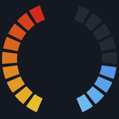
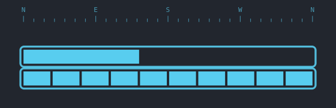
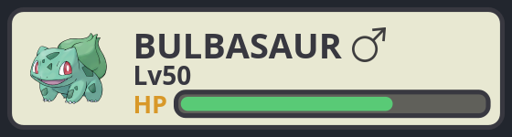
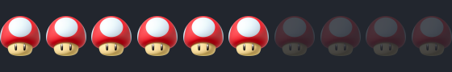

# gameify_notifications_overlay

Turn desktop notifications into a videogame HUD so you never miss one. Teams,
Outlook, or anything piles up as **"damage"** you can't ignore — and you heal it
by reading and dismissing notifications in a side panel. Built because
notification banners vanish after 5–10s and are easy to miss.

---

## What it does

Every notification that matches a rule adds **damage**. The active HUD renders
that damage as a game health/damage display; a dismiss panel lists the
notifications, and dismissing one **heals** the damage (and clears the
underlying system notification). Pick the HUD that suits you:

<table>
<tr>
<td align="center"><br><b><code>cod</code></b> — Call of Duty damage vignette (all monitors, click-through)</td>
<td align="center"><br><b><code>goldeneye</code></b> — health + armor arcs</td>
</tr>
<tr>
<td align="center"><br><b><code>halo</code></b> — shield + health bars</td>
<td align="center"><br><b><code>pokemon</code></b> — sprite + classic HP bar</td>
</tr>
<tr>
<td align="center" colspan="2"><br><b><code>mario</code></b> — mushroom lives (one lost per notification)</td>
</tr>
</table>

- **Not Teams-only.** A hot-reloaded `rules.toml` decides which apps matter and
  how much each adds; it ships with Teams + Outlook rules, and you add any app by
  adding a rule.
- **Configurable.** Per-overlay capacity, drain rate, colors, sizes, names — all
  live-editable while it runs.
- **Stays out of your way.** Won't damage you for an app you're already looking
  at; widget HUDs are movable/resizable; the CoD overlay is click-through.

---

## Install

**Requirements**

- **Python 3.11+** (uses the stdlib `tomllib`).
- **PySide6** (Qt for Python) — the GUI/drawing, installed by `pip` below.
- **Linux notification capture** also needs **PyGObject** (the `gi` bindings for
  D-Bus), installed as a system package.
- See [Platform support](#platform-support) for OS/desktop specifics.

**Steps**

```bash
git clone git@github.com:dnmarsch/gameify_notifications.git
cd gameify_notifications

# Linux only — D-Bus capture needs PyGObject from the system package manager
# (it can't be pip-installed cleanly), so install it first:
sudo apt install python3-gi              # Debian/Ubuntu  (Fedora: sudo dnf install python3-gobject)

# Create the venv WITH --system-site-packages so it can see the system `gi` module:
python3 -m venv --system-site-packages .venv && . .venv/bin/activate
pip install -e .                         # PySide6 + the app (console cmd: gameify_notifications)
```

> **Why `--system-site-packages`?** PyGObject (the `gi` D-Bus bindings) is a
> system package, not a pip wheel, so the venv must be allowed to see system
> packages. A plain `python3 -m venv .venv` is isolated and the app fails at
> startup with *"PyGObject (gi) is unavailable"*. If you already made the venv
> without the flag, just recreate it:
> `rm -rf .venv && python3 -m venv --system-site-packages .venv` (or set
> `include-system-site-packages = true` in `.venv/pyvenv.cfg`).

> **Moved or renamed the project folder?** A venv hardcodes its own absolute
> path, so moving/renaming the repo breaks it — the symptom is `python: command
> not found` *even after* `activate`. Recreate the venv with the command above.

---

## Run it

With the venv active (`. .venv/bin/activate`), the `gameify_notifications`
console command is on your `PATH`:

```bash
gameify_notifications                            # capture real notifications (default HUD: cod)
gameify_notifications --hud halo                 # or: cod | halo | mario | pokemon | goldeneye
gameify_notifications --hud goldeneye --test     # demo with fake notifications (no capture)
gameify_notifications --inspect                  # print raw notifications (no GUI) to map message types
gameify_notifications --list-huds                # list HUDs
```

(Equivalent: `python -m gameify_notifications …`.)

| Flag | Default | Description |
|------|---------|-------------|
| `--hud NAME` | `cod` | HUD to render: `cod`, `halo`, `mario`, `pokemon`, `goldeneye`, or a custom plugin. |
| `--match SUBSTR` | *(empty)* | Optional capture prefilter (substring of app/text). Empty = forward all and let `rules.toml` decide. |
| `--source SPEC` | `auto` | Capture strategy. `auto` = platform default (Linux composes `freedesktop`+`portal`); or a comma list; or a plugin name. |
| `--test` | off | Inject fake notifications to demo the HUD (no capture). |
| `--inspect` | off | Print raw captured notifications and exit (no GUI) — use to map message types. |
| `--list-huds` / `--list-sources` | — | List HUDs / capture strategies and exit. |
| `--log-level LEVEL` | `INFO` | `DEBUG`/`INFO`/`WARNING`/`ERROR`; gates records at the source. `--debug` = `DEBUG`. |
| `--log-file PATH` | `<config>/logs/gameify_notifications.log` | Override the log file path. |
| `--no-focus-suppress` | off | Always add damage, even for an app you're looking at. |
| `--install-autostart` / `--uninstall-autostart` | — | Manage the login autostart entry (Linux). |

Environment: `GAMEIFY_NOTIFICATIONS_LOG_LEVEL` overrides the level; `GAMEIFY_NOTIFICATIONS_CONFIG_DIR` relocates config/state/logs.

### Launch without activating the venv (Linux)

The installed `gameify_notifications` console script has a shebang pinned to the
venv's Python, so it runs the app — with PySide6 and `gi` resolved — **without
any activation**. Pick whichever entry point suits you:

```bash
# Run the venv's console script directly by full path — no activation needed:
~/gameify_notifications_overlay/.venv/bin/gameify_notifications

# Or put it on your PATH once, then just type `gameify_notifications` anywhere:
ln -s ~/gameify_notifications_overlay/.venv/bin/gameify_notifications ~/.local/bin/

# Or add an app-menu launcher you can click (appears in your apps grid):
cat > ~/.local/share/applications/gameify_notifications.desktop <<'EOF'
[Desktop Entry]
Type=Application
Name=Gameify Notifications
Comment=Desktop notifications as a videogame HUD
Exec=/home/YOU/gameify_notifications_overlay/.venv/bin/gameify_notifications
Icon=/home/YOU/gameify_notifications_overlay/gameify_notifications/assets/mushroom.png
Terminal=false
Categories=Utility;
EOF
```

(For the app-menu launcher, replace `/home/YOU/...` with your real absolute path
— `.desktop` files don't expand `~` or `$HOME`. Append `--hud halo` etc. to the
`Exec` line to pin a HUD.) The symlink works because `~/.local/bin` is on the
default `PATH`; these all keep working as long as the `.venv` stays in place.
On **Windows** / **macOS**, point a Startup shortcut / LaunchAgent at the venv's
`gameify_notifications` executable instead (see [Start on login](#start-on-login)).

### Start on login

```bash
gameify_notifications --install-autostart        # writes ~/.config/autostart/gameify_notifications_overlay.desktop
gameify_notifications --uninstall-autostart      # remove it
```

This is **Linux-only** (an XDG `.desktop` autostart entry whose `Exec` points at
your venv's Python running `-m gameify_notifications`). On Windows add a shortcut
to `shell:startup`; on macOS use a LaunchAgent.

---

## How Teams & Outlook are detected (PWA)

Notifications carry no semantic "category" over D-Bus — only app name + text — so
detection depends on **how** the app delivers them. The shipped rules target the
recommended setup: **run Teams and Outlook as Chrome PWAs** (Chrome → ⋮ → *Cast,
save, and share* → *Install page as app*), not the snap/Electron clients.

Why PWAs:

- **Clean matching by origin.** Chrome delivers each web notification through
  `org.freedesktop.Notifications.Notify` with the **site origin in the body**
  (e.g. `teams.cloud.microsoft`, `outlook.cloud.microsoft`). The default rules
  match those origins — stable regardless of message language/content:
  ```toml
  [[rule]]
  name  = "Teams message"
  match = 'teams\.cloud\.microsoft|teams\.microsoft\.com'
  weight = 1.5
  ```
- **Per-app focus suppression.** Each Chrome PWA gets its own window class
  `crx_<app-id>` (X11 `WM_CLASS`), so a rule's `focus_class` can suppress damage
  while that PWA is visible (see [`focus_class`](#dont-damage-me-for-the-app-im-looking-at-focus_class)).
  Find yours with `xprop WM_CLASS` (click the PWA window) or `chrome://apps`.
- **Reliable clearing.** The notifications daemon assigns each notification an
  **id** (returned from `Notify`). The overlay correlates that reply to learn the
  id, so dismissing in the panel issues `CloseNotification(id)` to clear the
  banner — and, on GNOME, the tray-purge extension removes the lingering list
  entry (matched by summary/body). See [GNOME system notifications](#gnome-system-notifications).

**Trade-off:** Chrome puts the *origin* in the body (great for matching) but not
the call/meeting/message granularity, so the default is a single "Teams message"
weight. The snap/Electron clients put the real message text in the body (finer
rules possible) but sandbox confinement can hide them entirely. Details and
per-install behavior: [`docs/notification-capture-ubuntu.md`](docs/notification-capture-ubuntu.md).

---

## Rules — which notifications count

`~/.config/gameify_notifications_overlay/rules.toml` is the filter (hot-reloaded,
so edits apply live). Each rule matches on the notifying **app name** (`app`,
regex) and/or the **text** (`match`, regex over `"summary | body"`); both are
optional. Rules are tested top-to-bottom, **first match wins**, and a
notification matching **no rule is ignored** (allowlist — no surprise damage from
Slack, system updates, etc.). `weight` is the damage it adds; `0` = listed in the
panel but no damage.

```toml
[[rule]]
name = "Incoming call"
app  = "teams"
match = "calling you|incoming call|is calling"
weight = 4.0

[[rule]]
name = "Outlook email"
app  = "outlook"          # matches the snap/Electron Outlook too (via D-Bus)
weight = 0.5

# add any app: run `gameify_notifications --inspect` to see its real app_name + text
```

Editing is safe and live (TOML hot-reload via stdlib `tomllib`). A single bad
rule — missing `name`, broken regex, non-numeric `weight` — is **logged and
skipped**, not fatal; if the whole file is mid-edit-broken, the last good rules
are kept.

### Don't damage me for the app I'm looking at (`focus_class`)

A rule may add an optional **`focus_class`** (regex). When a matching
notification arrives, the overlay checks whether that app has a window **visible
on any monitor** (mapped, not minimized, on the current workspace — not just the
*focused* window); if so, the notification is **dropped**. Disable globally with
`--no-focus-suppress`.

```toml
[[rule]]
name = "Teams message"
match = 'teams\.cloud\.microsoft'
focus_class = 'crx_ompifgpmddkgmclendfeacglnodjjndh'   # Teams PWA visible -> no damage
weight = 1.5
```

The *mechanism* is OS-generic (a regex matched against on-screen window ids from
a per-OS probe); the *value* is platform-specific — on **X11** it's the window's
`WM_CLASS` (Chrome PWAs are `crx_<app-id>`; find with `xprop WM_CLASS`), on
**Windows** the process exe (e.g. `chrome.exe`). Use an alternation
(`crx_…|chrome.exe`) for a cross-OS file.

### Tuning the HUDs (`max_messages`, `[hud.*]`)

The same `rules.toml` carries the HUD knobs; edits apply **live while the HUD is
on screen**. Per-rule `weight` is the damage; on top of that, **every `[hud.*]`
block accepts these optional universal knobs**:

```toml
max_messages = 0     # this HUD's damage capacity; 0 = inherit the global max_messages
weight_scale = 1.0   # drain-rate multiplier on notification weights (2.0 = 2x as fast)
width  = 0           # default widget box width  px (0 = the HUD's built-in size)
height = 0           # default widget box height px (0 = built-in)   — ⊕ resets to this
```

```toml
max_messages   = 10.0    # global damage / unread-message budget (HUDs inherit unless they set max_messages)
max_alpha = 0.7     # opacity ceiling

[hud.halo]          # shield + health bars
shield_fraction   = 0.5    # share of capacity given to the shield (rest = health); odd unit -> shield
health_red_at     = 0.5    # health turns red below this fraction
warning_at        = 0.25   # health fraction below which "WARNING" flashes
health_resolution = 2      # health-bar segments per health unit (higher = finer)

[hud.cod]           # damage vignette
clear_at_rest    = 0.85    # inner clear radius at 0 damage (1.0 = red only at edge)
max_encroachment = 0.18    # inner clear radius at full damage (smaller = red creeps further in)
intensity        = 0.5     # peripheral-red opacity slope (x damage x max_alpha)

[hud.mario]         # mushroom lives (one mushroom per unit of max_messages)
# icon_path   = "/path/to/icon.png"   # default: bundled mushroom (transparent bg)
lost_opacity = 0.18    # opacity of a lost mushroom (0 = hide it entirely)
gap          = 0.12    # spacing between mushrooms (fraction of icon width)
warning_at   = 0.25    # blink the last life/lives below this fraction

[hud.pokemon]       # sprite + classic HP bar (HP = remaining health)
name         = "BULBASAUR"   # shown above the level
level        = 50            # 1-100
# icon_path  = "/path/to/sprite.png"   # default: bundled Bulbasaur (bulbasaur/charmander/pikachu/squirtle bundled)
green_above  = 0.70    # HP at/above this -> green
yellow_above = 0.30    # HP at/above this -> yellow, below -> red

[hud.goldeneye]     # two facing arcs: left health (red->yellow), right shield (blue->cyan)
shield_fraction = 0.5    # share of capacity given to the shield (drains first)
segments        = 9      # ticks per arc
```

Halo & GoldenEye share one **shield-drains-first** model (shield empties entirely
before health). Unknown keys / bad values fall back to the defaults above, so a
typo while live-editing never crashes the HUD.

---

## HUDs

| name | scope | display |
|------|-------|---------|
| `cod` | all monitors | click-through red vignette; the red creeps in from the edges and flashes on each hit |
| `halo` | primary monitor | movable/resizable shield + health bars; shield drains first (damaged part goes clear), health turns red below 50% with a WARNING pulse |
| `mario` | primary monitor | movable/resizable row of mushroom lives; one lost per unit of damage (faded ghosts), last life blinks when low; swappable icon |
| `pokemon` | primary monitor | movable/resizable sprite + classic battle box (name, level, HP bar); HP green→yellow→red; name/level/sprite configurable |
| `goldeneye` | primary monitor | movable/resizable two facing gradient arcs — left health (red→yellow), right shield (blue→cyan); shield drains first |

Widget HUDs are draggable, resizable (size grip), and persist their geometry; the
**⊕** button resets the box to its configured/default size and re-centers. Custom
HUDs: drop a `*.py` defining a `Hud` subclass into
`~/.config/gameify_notifications_overlay/huds/` (a template is written on first run).

### The dismiss panel

Lists every captured notification with a per-item **✕** and **Clear all**, and
shows total **DAMAGE %** for the active overlay. Resizable (size grip),
collapsible to a one-line toolbar (▾/▸), and dismissing an item heals the damage
and clears the underlying system notification.

By default (`dock_panel = true`) the panel is **docked beneath widget HUDs**
(halo/mario/pokemon/goldeneye) as one unit: its width follows the HUD (the HUD's
size grip drives both; a ~320px readable minimum, left-aligned under narrower
HUDs like GoldenEye), it keeps its own height (drag the grip down to grow the
list), and dragging either window moves the pair. Set `dock_panel = false` (then
restart) for a separate floating panel. The `cod` overlay spans all monitors and
always uses a free-floating panel.

---

## Platform support

| OS | Status | Notes |
|----|--------|-------|
| **Linux / X11** | ✅ Supported (primary target) | All HUDs. The all-monitor click-through `cod` overlay relies on X11 `Qt.WindowTransparentForInput`; focus suppression uses `xprop` (`WM_CLASS`). |
| **Linux / Wayland** | ⚠️ Partial | Widget HUDs work; the global click-through overlay and `xprop`-based focus suppression don't (no portable Wayland API) — they degrade to no-op. Run a GNOME/KDE **X11** session for full support. |
| **Windows** | 🚧 Stub | Capture via WinRT `UserNotificationListener` (`windows_source.py`) — needs the `winrt` packages + user-granted notification access. Click-through overlays supported. Autostart: `shell:startup` shortcut. |
| **macOS** | ❌ Unsupported | No public API to read other apps' notifications. |

**Window manager:** the project targets **X11** (tested on GNOME Shell 46 / X11).
The widget HUDs are ordinary top-level windows and work under most WMs; the `cod`
all-monitor click-through overlay specifically depends on X11.

### GNOME system notifications

GNOME shows a banner (~5s) and then keeps the notification in its **notification
list** (the calendar drawer). When you dismiss in the panel, the overlay closes
the banner via `CloseNotification(id)` — but GNOME keeps the **list** entry, and
there's no standard D-Bus way to remove it. So an optional GNOME Shell extension
ships in [`gnome-extension/`](gnome-extension/):

```bash
cd gnome-extension && ./install.sh
# then reload GNOME Shell (Alt+F2 -> r on X11, or log out/in) and:
gnome-extensions enable gameify-tray-purge@gameify.local
```

It exposes `org.gameify.TrayPurge` (`DismissMatching(summary, body)` / `ClearAll()`)
and removes the matching list entry when you dismiss in the overlay. **Without it,
dismissing still heals damage and closes the banner** — only GNOME's drawer entry
lingers. (Other desktops — KDE, dunst — can implement their own `TrayCleaner`.)

---

## Capture strategies (`--source`)

Different installs route notifications differently, so capture is pluggable.
`--source auto` (default) composes the platform built-ins; on Linux that's
**freedesktop + portal** together, so both native (`.deb`/Firefox) and confined
(snap/flatpak via the XDG portal) apps are caught. Add your own by dropping a
`NotificationSource` subclass into `~/.config/gameify_notifications_overlay/sources/`
(template written on first run), selectable by its `name`.

| name | what it watches |
|------|-----------------|
| `freedesktop` | `org.freedesktop.Notifications.Notify` (Chrome/Chrome-PWA, teams-for-linux deb/rpm/AppImage, Firefox) |
| `portal` | XDG Desktop Portal `AddNotification` (snap / flatpak confined apps) |
| `windows` | WinRT `UserNotificationListener` (Windows) |

Capture is **event-driven**, not polling: the Linux sources attach to the session
bus via `BecomeMonitor` and a message filter on a background GLib loop; events
reach the UI through the `DamageState` observer + a queued Qt signal. (The HUD
repaints at ~30fps only while animating.)

---

## Persistence & multi-monitor safety

`state.json` stores window geometry. The **panel** stores absolute pixels (a text
list — legibility over scaling) with a 95% max-fraction clamp. The **HUD widget**
stores geometry as a **fraction of its monitor**, so it rescales proportionally
on resolution/orientation change. Both validate against the current monitor
layout on start and on monitor hotplug, snapping back if a window would land
off-screen.

## Logging / debugging

Logging is **non-blocking**: app threads push records onto a queue (`QueueHandler`);
one background `QueueListener` thread does the file I/O. Every record carries the
thread name, module, function, and line number:

```
2026-06-11 10:39:20 DEBUG [MainThread] gameify_notifications.app.on_notification:30 - notification app='Microsoft Teams' summary='Carol' -> category=Incoming call weight=4.0
```

One rotating log file (`~/.config/gameify_notifications_overlay/logs/gameify_notifications.log`)
plus the console; the level gates records at the call site. `--debug`,
`--log-level`, `--log-file`, and `GAMEIFY_NOTIFICATIONS_LOG_LEVEL` all work.

## Architecture

Single-responsibility modules; the core is GUI-free and unit-testable on its own:

```
gameify_notifications/
  config.py        paths, default rules, state persistence, autostart   (stdlib)
  geometry.py      monitor math, off-screen clamp, fractional rescale    (stdlib)
  rules.py         notification -> (category, damage weight)             (stdlib)
  state.py         accumulated damage + observers                        (stdlib)
  app.py           platform-agnostic App context                         (stdlib)
  huds/            QPainter HUD renderers + plugin loader + render_to_image (Qt)
    cod.py  halo.py  mario.py  pokemon.py  goldeneye.py
    params.py (validated [hud.*] tuning)   shield_health.py (shared shield/health model)
  sources/         NotificationSource ABC + select_source                (per-OS)
    dbus_source.py      Linux: eavesdrop org.freedesktop.Notifications + portal
    windows_source.py   Windows: WinRT UserNotificationListener
  backends/        OverlayBackend ABC + select_backend
    qt/  backend.py persistence.py overlay_window.py widget_window.py panel_window.py _context.py
  tray.py          TrayCleaner ABC + select_tray_cleaner (GNOME extension bridge)
  focus.py         FocusProbe ABC + select_focus_probe (X11/Windows/no-op)
  __main__.py      CLI entry
```

Swappable seams keep it portable and extensible: **`NotificationSource`**
(capture), **`OverlayBackend`** (windowing), **`Hud`** + **`ParamSpec`** (HUDs +
validated config), **`TrayCleaner`** (system-list clearing), **`FocusProbe`**
(on-screen detection). Add a platform/feature by implementing a seam and
registering it in the matching `select_*` factory — no edits to unrelated code.

## Tests

```bash
pip install -e ".[dev]"               # pytest + pytest-qt
QT_QPA_PLATFORM=offscreen pytest      # headless
```

Pure-logic unit tests (geometry/rules/state/app/params) + `pytest-qt` tests for
HUD rendering and widget behavior, plus the GNOME extension's matching logic via
`gjs`. See [`tests/TEST_PLAN.md`](tests/TEST_PLAN.md).

## Docs

- [`docs/notification-capture-ubuntu.md`](docs/notification-capture-ubuntu.md) —
  what Teams/Outlook actually emit per install (snap vs Chrome vs Firefox),
  capture limits (AppArmor confinement, focus-suppression), latency, the
  match-on-origin strategy, and the GNOME-tray-sync design.
- [`docs/snap-to-deb-firefox.md`](docs/snap-to-deb-firefox.md) — moving Firefox
  off snap to the unconfined `.deb` so its notifications are capturable.

## Known limitations

- Categorization is text/app-based (D-Bus exposes no semantic "category"); tune
  `rules.toml` against `--inspect` output for each app.
- A widget HUD captures clicks where it sits (so you can drag it) — move it aside
  if it covers something.

## Contributing

Read [`CONSTITUTION.md`](CONSTITUTION.md) first — the source of truth for how
changes are made here: tests required for every created/modified implementation,
SRP / Open–Closed, the established patterns (Strategy+DI, Factory, Observer,
validated-param ADTs, mixins), DRY with composition over inheritance, OS-agnostic
additions behind a seam, and `docs/` updated when a new OS/technology lands.

## License

[MIT](LICENSE) © 2026 Derek Marsch.
